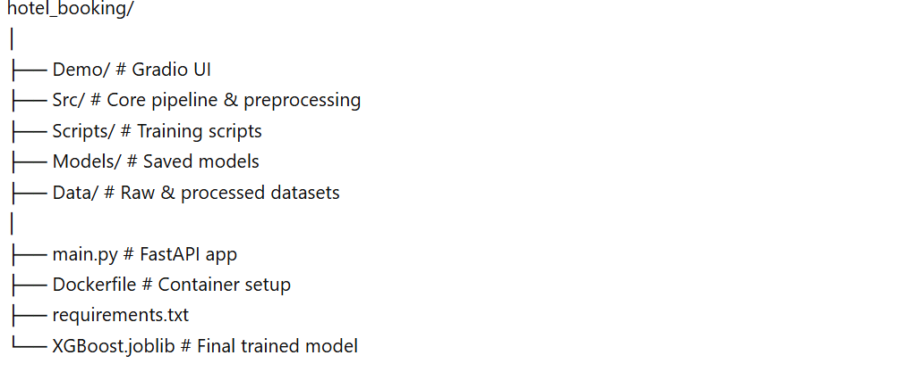

# 🏨 Hotel Booking Cancellation Predictor

An end-to-end Machine Learning project that predicts whether a hotel booking will be **canceled or not**, deployed using **FastAPI, Gradio UI, and Docker**.

---

## 🚀 Project Overview

Hotel booking cancellations create uncertainty for revenue and operations.  
This project builds a **machine learning classification system** to predict cancellation likelihood based on booking details.

The system includes:
- Data preprocessing pipeline
- Feature engineering & analysis
- Machine learning model (XGBoost)
- API deployment (FastAPI)
- Interactive UI (Gradio)
- Containerization (Docker)

---

## 🎯 Problem Statement

Hotels face high uncertainty due to cancellations.  
This project aims to:

- Predict cancellation (0 = Not canceled, 1 = Canceled)
- Help optimize booking strategies
- Improve revenue management decisions

---

## 🧠 Model & Approach

### 🔹 Pipeline
- Data cleaning & preprocessing  
- Feature engineering  
- Encoding categorical variables  
- Handling missing values  
- Feature selection  

### 🔹 Models Tested
- Decision Tree  
- Random Forest  
- Stacking Classifier  
- XGBoost (Final Model ✅)

### 🔹 Final Model
- **XGBoost Classifier**
- Selected for best performance and generalization

---

## 📊 Features Used

The model uses booking-related features such as:

- Lead time  
- Customer type  
- Deposit type  
- Number of guests  
- Special requests  
- Room type  
- Market segment  
- Booking changes  

> ⚠️ Note: Some features like `reservation_status` may introduce **data leakage** in real-world scenarios.

---

## 🏗️ Project Structure

## 💼 Business Value

This project goes beyond technical implementation and provides real-world business impact for the hospitality industry.

### 🔹 Revenue Optimization
By predicting which bookings are likely to be canceled, hotels can:
- Apply **overbooking strategies safely**
- Reduce revenue loss from last-minute cancellations
- Improve occupancy rates

---

### 🔹 Better Decision-Making
Hotel managers can use predictions to:
- Adjust pricing dynamically  
- Offer targeted promotions to high-risk customers  
- Optimize room allocation strategies  

---

### 🔹 Customer Behavior Insights
The model highlights important factors influencing cancellations, helping businesses:
- Understand guest behavior  
- Improve customer experience  
- Design better booking policies  

---

### 🔹 Operational Efficiency
With early cancellation predictions:
- Staff planning becomes more accurate  
- Resource allocation improves  
- Inventory (rooms) is managed more effectively  

---

### 🔹 Scalable Deployment
The system is production-ready:
- FastAPI enables integration with hotel systems  
- Gradio provides an easy interface for non-technical users  
- Docker ensures consistent deployment across environments  

---

## 📌 Real-World Impact

This type of system can be integrated into:
- Hotel reservation platforms  
- Online travel agencies (OTA)  
- Revenue management systems  

Helping businesses move from **reactive decisions → data-driven strategies**.